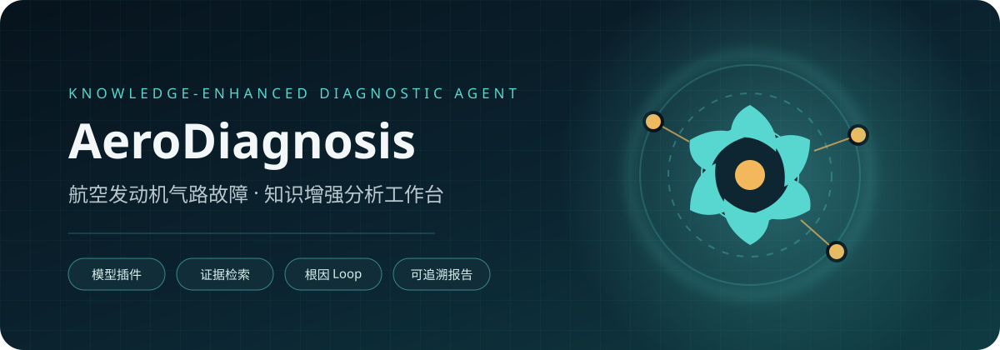
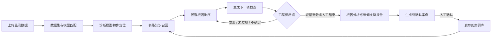
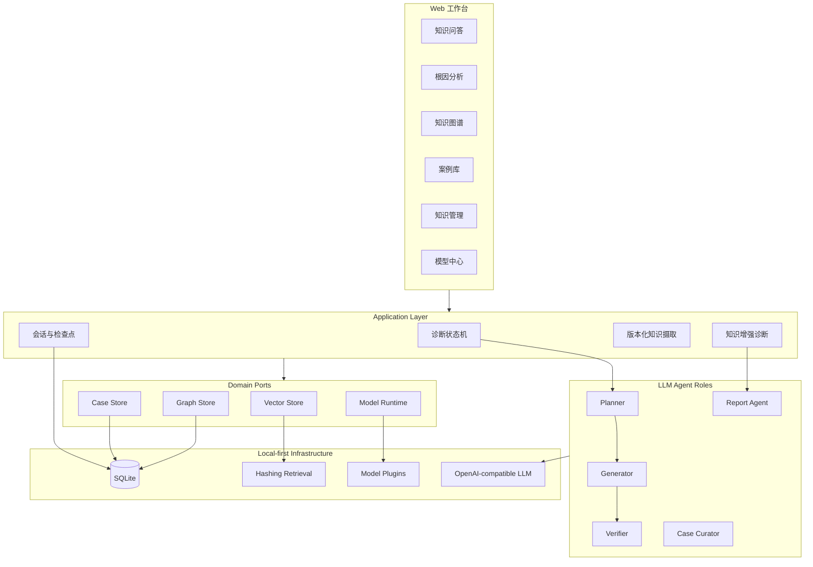

<div align="center">



# AeroDiagnosis Next

### 面向航空发动机气路故障诊断的知识增强 Agent

让诊断模型负责“发现异常方向”，让 Agent 结合知识与工程师反馈完成“根因推理、排查闭环与维修支持”。

[](https://github.com/Inner-vic/AeroDiagnosis-Next/actions/workflows/ci.yml)
[](https://www.python.org/)
[](https://fastapi.tiangolo.com/)
[](#质量与验证)
[](#质量与验证)
[](LICENSE)

</div>

---

## 为什么做这个项目

航空发动机气路故障往往表现为多个参数共同变化。深度学习模型可以给出部件级或故障类别级的初步判断，但一个“风扇异常”或“压气机异常”的标签，并不能直接回答：

- 为什么会出现这一现象？
- 哪些候选根因更值得优先排查？
- 下一步应该检查什么？
- 新观察会如何改变已有判断？
- 最终结论由哪些知识与现场证据支撑？

AeroDiagnosis 的定位不是替代诊断模型，而是在模型结果之后增加一个**知识增强、人在回路、证据可追溯**的分析层。



## 核心能力

| 模块 | 能力 | 当前实现 |
|---|---|---|
| 知识问答 | 基于知识库、图谱和案例回答问题，逐主张显示证据 | ✅ |
| 交互式根因分析 | 数据上传触发模型推理与多轮排查 Loop | ✅ |
| 模型插件中心 | 模型清单、数据集绑定、特征契约、标签空间与 OOD 拒绝 | ✅ |
| 知识图谱 | 力导向布局、拖拽、缩放、平移、邻接高亮、详情与图片导出 | ✅ |
| 案例库 | 保存现象、诊断依据、排查过程和结果，支持检索 | ✅ |
| 诊断知识闭环 | 报告生成案例草稿，经确认后发布到案例库并参与后续检索 | ✅ |
| 多路召回 | 知识文档、图谱和案例加权 RRF 融合，展示路由排名与分数组成 | ✅ |
| 知识管理 | TXT、Markdown、CSV 上传与不可变版本管理 | ✅ |
| 短期会话记忆 | 问答历史持久化、回放与显式删除 | ✅ |
| 多模型接入 | 本机默认模型或使用者自己的 OpenAI-compatible API | ✅ |
| Agent 可恢复运行 | 状态快照、工具预算、checkpoint 与有限纠错 | ✅ |
| 评测管道 | 数据集哈希、逐样本记录和确定性指标 | ✅ 基线 |

## 一条真正可执行的诊断 Loop

系统不是把模型标签直接交给大模型自由发挥，而是把每一步都限制在可验证的状态变化中：

1. 上传 CSV 并选择与数据集匹配的诊断模型。
2. 校验字段、数值范围和分布外风险，不匹配时拒绝推理。
3. 诊断模型输出初步类别、部件和概率。
4. Agent 从知识、图谱和案例中构造有限的候选根因。
5. Planner 选择信息增益更高且风险可控的下一项检查。
6. 工程师反馈“发现、未发现、不确定或无法检查”。
7. 系统更新候选分数和证据状态，进入下一轮。
8. 报告 Agent 只基于冻结证据生成根因分析与维修支持参考。
9. Case Curator 将完整轨迹整理成待确认案例，人工确认后进入案例库。

整个过程保存模型结果、知识证据、候选变化、现场观察、Agent 轨迹与最终报告，可供回放和审计。

## 可解释的 Top K 多路召回

知识文档、知识图谱和案例库的原始分数不在同一尺度上，不能直接放在一起排序。
AeroDiagnosis 使用 `weighted_rrf@1` 执行以下过程：

1. 每一路独立扩大候选集，并保留原始相关度和路由内排名；
2. 使用加权 Reciprocal Rank Fusion 统一排名尺度；
3. 当 Top K 足够时启用来源覆盖约束，防止单一路由占满结果；
4. 返回每条证据的原始分、路由排名、权重、融合分和入选原因；
5. 对带有人工相关性标注的数据计算 Precision@K、Recall@K、MRR、nDCG@K 和来源覆盖率。

融合分只表示检索排序相关度，不表示故障发生概率或维修结论置信度。

## 系统架构



设计上的关键约束：

- LLM 只能选择白名单工具与候选动作。
- 每次运行冻结活动知识版本，避免途中知识更新导致结果漂移。
- Verifier 逐主张检查证据引用；证据不足时显式拒答。
- API Key 不写入数据库、checkpoint、会话记录或日志。
- 默认本地运行，不强制依赖 Docker、Neo4j、Chroma 或本地大模型。

## 界面与交互

前端提供三套可即时切换的视觉主题：

- **深色科技**：适合日常诊断工作台和现场展示。
- **论文浅色**：适合论文截图、报告和打印。
- **实验室蓝**：适合实验平台与答辩演示。

知识图谱采用可交互力导向布局。用户可以拖动单个节点、缩放和平移画布、点击节点查看来源及关联关系，也可以导出当前图谱图片。

知识问答入口支持文本附件和浏览器语音输入；引用依据默认折叠，避免证据面板干扰主要阅读路径。

## 快速开始

### 环境要求

- Windows 10/11
- Python 3.13
- [uv](https://docs.astral.sh/uv/)

### 安装与启动

```powershell
git clone https://github.com/Inner-vic/AeroDiagnosis-Next.git
Set-Location .\AeroDiagnosis-Next

.\scripts\Initialize-AeroDiagnosis.ps1
.\scripts\Test-AeroDiagnosis.ps1 -Full
.\scripts\Start-AeroDiagnosis.ps1
```

打开：

- Web 工作台：<http://127.0.0.1:8080/>
- OpenAPI 文档：<http://127.0.0.1:8080/docs>
- 系统状态：<http://127.0.0.1:8080/api/system>

停止服务：

```powershell
.\scripts\Stop-AeroDiagnosis.ps1
```

虚拟环境、SQLite 数据、缓存和日志默认位于仓库内的 `.runtime/`，不会污染系统 Python 环境。

## LLM API 配置

### 方式一：每位使用者在前端配置

在“模型与 API 设置”中填写 OpenAI-compatible Base URL、模型名称和 API Key。配置只保存在当前浏览器标签页的 `sessionStorage` 中。

### 方式二：本地展示默认配置

复制环境变量模板，并在被 Git 忽略的 `.env.local` 中配置：

```dotenv
AERODIAGNOSIS_LLM_BASE_URL=https://api.example.com/v1
AERODIAGNOSIS_LLM_MODEL=your-model-name
AERODIAGNOSIS_LLM_API_KEY=your-api-key
```

也可以使用 `AERODIAGNOSIS_LLM_API_KEY_FILE` 引用仓库外的密钥文件。系统状态接口只返回默认模型是否可用，不返回密钥。

## 模型插件协议

每个诊断模型通过清单声明：

- `model_id` 与版本；
- 绑定的 `dataset_id`；
- 输入特征、单位和允许范围；
- 输出类别、部件映射和概率；
- 运行时类型与模型文件位置；
- 适用范围和拒绝条件。

这使“数据集 A → 模型 A”“数据集 B → 模型 B”成为显式契约，避免把某一型号或某个仿真数据集上训练的模型错误应用到未知数据。

仓库内置一个用于贯通流程的声明式线性模型。它用于验证插件协议与 Agent Loop，不代表真实深度学习模型的诊断性能。后续可在不修改上层 Agent 的情况下接入 ONNX、TorchScript 或独立推理服务。

## 知识、图谱与案例

知识文件通过版本化摄取服务发布。更新同一逻辑文档时会生成新的不可变修订；旧版本保留用于审计，但不会参与新的活动检索。

```powershell
.\.runtime\.venv\Scripts\aerodiagnosis-ingest.exe .\samples\manual.txt

.\.runtime\.venv\Scripts\aerodiagnosis-ingest.exe .\samples\manual-v2.txt `
  --document-id <previous-document-id>
```

当前支持 `.txt`、`.md`、`.markdown` 和 `.csv`。前端知识发布接口需要用户自行设置 `AERODIAGNOSIS_OPERATOR_TOKEN`，以避免本地页面被意外写入。

## MCP 与 API

项目提供复用同一应用层用例的 MCP Server：

```powershell
.\.runtime\.venv\Scripts\aerodiagnosis-mcp.exe
```

主要 API：

| Endpoint | 用途 |
|---|---|
| `POST /api/sessions` | 创建知识问答会话 |
| `POST /api/diagnoses` | 运行证据增强问答 |
| `GET /api/graph` | 获取活动知识图谱 |
| `GET /api/cases` | 检索案例 |
| `POST /api/documents` | 发布或更新知识文档 |
| `GET /api/models` | 浏览模型插件 |
| `POST /api/root-cause-sessions` | 上传数据并启动根因分析 |
| `POST /api/root-cause-sessions/{id}/observations` | 提交工程师观察并继续 Loop |
| `POST /api/root-cause-sessions/{id}/finalize` | 生成并冻结分析报告 |
| `POST /api/root-cause-sessions/{id}/case` | 确认案例草稿并发布到案例库 |
| `POST /api/retrieval/hybrid` | 执行可解释的文档、图谱与案例多路召回 |
| `POST /api/retrieval/evaluate` | 使用证据相关性标注计算 Top K 评测指标 |

## 项目结构

```text
src/aerodiagnosis/
├── domain/                 # 领域模型、证据和诊断状态
├── application/            # 用例、Agent 工作流、快照和模型协议
├── ports/                  # 存储与运行时抽象
├── ingestion/              # 文档解析、版本清单和原子发布
├── adapters/
│   ├── api/                # FastAPI 入站适配器
│   ├── llm/                # OpenAI-compatible 模型适配器
│   ├── mcp/                # MCP Server
│   ├── persistence/        # SQLite 图、向量、案例与记忆
│   └── web/                # 多主题知识增强工作台
└── bootstrap.py            # 唯一组合根

evaluation/                 # 版本化评测数据集与评分器
tests/                      # 单元、契约、迁移和特征测试
scripts/                    # Windows 初始化、检查、启动和停止脚本
docs/                       # 架构、升级、部署和状态文档
code/python/                # 旧版原型，仅用于迁移期行为参考
```

## 质量与验证

```powershell
.\scripts\Test-AeroDiagnosis.ps1 -Full
```

当前基线：

- 99 项自动化测试通过；
- 总覆盖率 88.63%；
- Ruff 静态检查通过；
- mypy strict 类型检查通过；
- wheel 与 source distribution 可重复构建；
- 测试不需要 API Key、模型下载或外部数据库。

## 推荐的发展方向

### 1. 可学习重排

当前已经完成三路加权 RRF、来源覆盖约束与标准检索指标；下一步可引入领域 embedding、交叉编码器或学习排序，并与当前确定性基线开展对照实验。

### 2. 图谱稳健性与知识演化

为实体和关系加入来源、时间、置信度、冲突状态和版本；支持同义实体消歧、冲突检测、增量抽取与人工审核闭环。

### 3. 根因分析策略学习

把检查成本、风险、可执行性和预期信息增益纳入下一步动作选择，并通过离线回放比较不同 Agent 策略。

### 4. 真实模型运行时

补充 ONNX/TorchScript 插件、时序窗口处理、特征映射、置信度校准、漂移检测和批量诊断任务。

### 5. 论文级评测

建立可追溯场景集，开展无知识增强、单路检索、多路检索、无图谱、无工程师反馈等消融实验；同时评估结论正确性、证据忠实度、排查轮次和成本。

## 文档

- [架构主干](docs/architecture/architecture-AeroDiagnosis-2026-09-12/ARCHITECTURE-SPINE.md)
- [多路召回与 Top K 融合设计](docs/architecture/HYBRID-RETRIEVAL.md)
- [交互式根因分析方案](docs/upgrade/INTERACTIVE-RCA-AGENT-PLAN.md)
- [部署、备份与故障排查](docs/DEPLOYMENT.md)
- [当前实现状态](docs/STATUS.md)

## 使用边界

本项目是研究与工程验证平台，不构成适航批准的维修或运行决策系统。输出必须由具备资质的人员结合适用型号手册、实际工况和现场检查结果复核。

公开仓库不得提交专有手册、敏感运行数据、真实 API Key 或其他受限制资料。

## License

[MIT](LICENSE)
