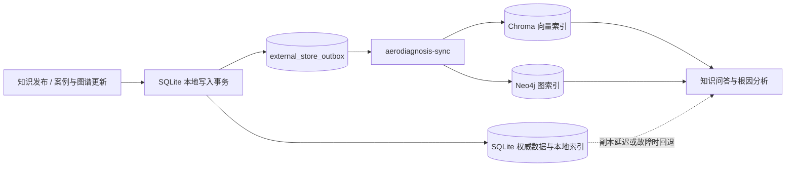

# Neo4j / Chroma 增量同步设计

## 目标

完整部署保留 Neo4j 的图遍历能力和 Chroma 的向量检索能力，同时避免把 SQLite、Chroma、
Neo4j 当成一个并不存在的分布式事务。SQLite 是唯一权威数据源，后两者是可以重建的派生索引。

## 写入与同步



本地记录与 Outbox 事件在同一个 SQLite 事务中提交，因此不会出现“本地写成功但同步任务丢失”
的窗口。事件 ID 由数据流、操作、聚合 ID 和规范化载荷确定性生成，重复投递由 Chroma/Neo4j
的幂等 upsert 收敛。Worker 使用短租约 claim、失败退避和有限重试；进程异常退出后过期租约
会重新进入待处理状态。

## 读取一致性

- Outbox 对应数据流没有待处理事件时，读取外部索引。
- 外部副本不可达、同步失败或仍有积压时，自动读取 SQLite 本地索引。
- `version_id` 随向量块、节点和关系同步，查询只使用 SQLite 清单声明的活动版本。
- `/api/system` 暴露同步模式与事件计数，不暴露凭据。

这提供的是可恢复的至少一次增量复制，而不是跨数据库强一致事务。完整模式适合单机或单节点
展示、实验和中小规模部署；大规模压测、多节点协调以及外部索引灾难恢复演练仍需单独完成。

## 为什么没有恢复 Kafka

旧版 Compose 虽然包含 Kafka/Zookeeper 服务和依赖，但没有业务生产者、消费者或可验证的数据
流，不能构成 CDC。当前事务 Outbox 已覆盖本项目真实存在的单机增量复制需求，也保留了事件
重放和以后迁移到消息代理的边界。只有吞吐、隔离或跨节点需求经测量超出 SQLite Worker 能力时，
才需要引入 Kafka，而不是为了架构展示预先增加常驻组件。

## 运维入口

```powershell
$env:NEO4J_PASSWORD = "replace-with-a-strong-password"
docker compose -f compose.yaml -f compose.full.yaml up --build -d --wait
docker compose -f compose.yaml -f compose.full.yaml ps
```

停止时不要添加 `--volumes`。权威 SQLite 数据位于 `aerodiagnosis-runtime`，外部派生索引分别位于
`aerodiagnosis-chroma` 和 `aerodiagnosis-neo4j`。详细备份、恢复与迁移约束见
[部署文档](../DEPLOYMENT.md)。
