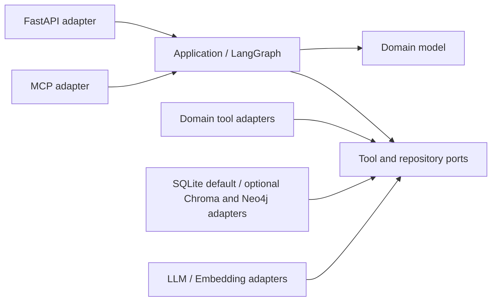
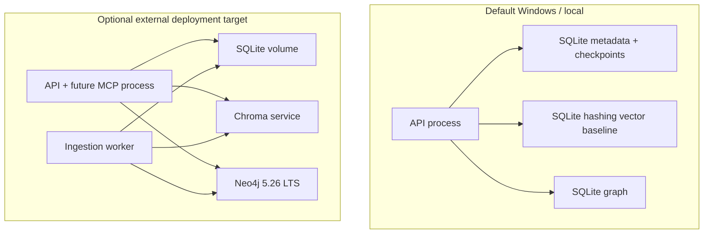

# Architecture Spine — AeroDiagnosis v3

## Design Paradigm

采用“六边形模块化单体 + 可持久化状态机工作流”。领域模型位于中心；LangGraph 编排用例和工具端口；FastAPI、MCP、LLM、Chroma、Neo4j 与 checkpoint 都是适配器。仅当测量证明需要独立扩缩容或故障隔离时才拆分服务。



## Invariants & Rules

### AD-1 — 模块依赖只能指向领域中心

- **Binds:** all
- **Prevents:** API、数据库、模型 SDK 和业务规则互相穿透，导致测试与替换困难。
- **Rule:** `domain` 不依赖任何框架；`application` 只依赖 `domain` 与端口；入站和出站适配器实现端口且不得被领域层反向导入。

### AD-2 — Agent 身份由状态与动作决定

- **Binds:** v3-agent-runtime
- **Prevents:** 将固定函数流水线或 Prompt 包装类误称为 Agent。
- **Rule:** 诊断运行必须由 LangGraph 状态图承载，至少包含工具选择、条件路由、预算、持久化 checkpoint 和可恢复执行。状态使用可序列化的 `TypedDict` 传输，每个节点入口和出口必须用版本化 Pydantic 模型显式校验完整状态；不得依赖 LangGraph 仅对首节点输入提供的自动校验。

### AD-3 — 所有能力先定义领域工具契约

- **Binds:** v3-agent-runtime, v3-mcp
- **Prevents:** LLM、FastAPI 和 MCP 分别实现同一能力并产生不兼容语义。
- **Rule:** 检索、图谱、案例、参数分析和证据读取均以单一 Pydantic 输入/输出契约实现；请求必须包含 `schema_version/run_id/call_id/deadline/actor/payload`，结果必须包含 `status/data/error/evidence_ids/backend/started_at/finished_at`，其中 status 仅允许 `ok/error/timeout/cancelled/degraded`。LangGraph、FastAPI 和 MCP 只能映射该契约，不得复制或改变业务语义；不兼容变更提升 major schema version。

### AD-4 — MCP 仅为入站适配器

- **Binds:** v3-mcp
- **Prevents:** 内部模块经由 MCP 回环调用，增加延迟并将协议细节污染应用层。
- **Rule:** 内部 Agent 直接调用领域工具端口；MCP Server 与 FastAPI 并列，仅向外部客户端暴露经过权限筛选的同一组工具。

### AD-5 — 证据具有稳定身份和完整来源

- **Binds:** v3-evidence, v3-agent-runtime, v3-evaluation
- **Prevents:** 按文本前缀去重、模型伪造引用、数据更新后无法复现结论。
- **Rule:** `document_id` 是 SQLite 登记的 UUIDv4 逻辑文档身份；`version_id=sha256(document_id + canonical_content_hash + parser_version)`；`chunk_id=sha256(version_id + canonical_locator + normalized_content_hash)`；`evidence_id=sha256(source_kind + immutable_source_ref + canonical_locator)`。证据不可原地修改，携带页码/工作表/单元格/图路径等类型化定位、来源置信度和上游 chunk ID；报告引用只能从运行状态中的不可变证据生成，旧版本至少保留到引用它的运行与实验过期。

### AD-6 — 验证失败必须改变控制流且默认不通过

- **Binds:** v3-agent-runtime
- **Prevents:** 相同输入原样重试以及解析异常被当作验证成功。
- **Rule:** Verifier 输出未支撑主张、证据缺口和建议动作；下一轮必须修改查询、工具或候选诊断。验证异常进入 `unverified`；预算耗尽输出证据不足或人工复核状态，不得输出“已验证”。

### AD-7 — 检索策略是版本化实验配置

- **Binds:** v3-evidence, v3-evaluation
- **Prevents:** 多套 RRF 权重、隐式降级和无法复现实验。
- **Rule:** 每次运行记录检索器集合、权重、top-k、阈值、重排器、Prompt 和模型版本；项目中只能有一个融合实现，降级后端必须显式进入运行结果。

### AD-8 — 入库以版本为原子发布单元

- **Binds:** v3-evidence
- **Prevents:** 向量库、图谱和文档清单部分成功，或重复上传产生脏索引。
- **Rule:** SQLite 清单是可见性与当前版本的唯一权威，版本状态只能按 `received → parsed → indexing → staged → active` 转移，失败进入 `failed`，替换进入 `superseded`，删除按 `deleting → deleted`。同一 document 的接收事务分配单调 `revision` 并更新 `desired_revision`；发布事务只有在 `candidate_revision=desired_revision`、fencing token 有效且计数/哈希匹配时才原子切换 active 指针，较旧并发 job 进入 superseded。Chroma 与 Neo4j 记录必须携带 `version_id/job_id`，所有检索先读取 active 指针并过滤非 active 版本。崩溃恢复器按幂等步骤继续任务，无法继续时 tombstone 并清理孤儿索引；逻辑删除先于异步物理删除。

### AD-9 — 离线评测是发布门禁

- **Binds:** v3-evaluation, all releases
- **Prevents:** README、论文和简历使用不可复现或选择性汇报的指标。
- **Rule:** `eval/policy.yaml` 必须版本化并绑定冻结数据集哈希、基线 commit、最小样本量、随机种子/重复次数、主次指标、允许回归阈值、配对统计检验、显著性水平、最小效应量和最大基础设施失败数。Release 运行完整门禁并保存逐样本结果、配置与 Git commit；PR 只运行不作论文结论的 smoke 子集。任何安全/引用契约失败、基础设施失败超限或主指标越过阈值都阻止发布；降低门槛必须新增架构决策，不能临时 override。

### AD-10 — 可观测事件不记录私有思维链

- **Binds:** v3-agent-runtime, v3-evaluation
- **Prevents:** 无法定位工具与节点故障，或泄露模型内部推理与敏感文档。
- **Rule:** 每个节点和工具调用记录服务端生成的 trace ID、状态转移、证据 ID、耗时、token、错误与降级状态。telemetry 严禁持久化隐藏思维链、证据原文、Prompt 原文、密钥或未列入字段白名单的工具参数，只允许内容哈希、长度和脱敏摘要；入站 client trace/baggage 不可信，服务端重建 trace 身份，仅向配置白名单中的后端传播 W3C trace context 且不传播 baggage。

### AD-11 — 演示模式与管理权限不可混淆

- **Binds:** API, MCP, v3-evidence
- **Prevents:** 公开演示中的默认口令、未鉴权写接口和任意文件/Cypher 执行。
- **Rule:** 公开托管演示固定为匿名只读并禁用所有写工具；本地课题模式的写操作仅绑定 loopback 且要求环境注入的 operator token。若未来开放公网写入，必须先新增 OIDC/RBAC 决策。所有工具输入须经过 schema、大小、路径、关系类型和权限校验。

### AD-12 — 禁止装饰性基础设施

- **Binds:** deployment, all
- **Prevents:** Compose 和依赖中出现没有真实数据流、测试和运维语义的 Kafka、数据库或框架。
- **Rule:** 依赖只有在存在调用方、集成测试、健康检查和故障处理时才能进入默认部署；否则删除并记录在 Deferred。

### AD-13 — Agent 恢复采用至少一次与幂等副作用

- **Binds:** v3-agent-runtime, v3-evidence
- **Prevents:** checkpoint 恢复重复执行外部写入、预算回退或跨工作流版本错误恢复。
- **Rule:** 每次运行保存 `run_id/workflow_version/state_schema_version/checkpoint_seq` 和只增不减的 token、时间、轮次、工具调用预算。规划节点为每个逻辑副作用生成跨重试稳定的 `call_id`，工具使用 `operation_id=sha256(run_id + call_id + tool_name + canonical_args)`；`attempt` 只作为观测字段，不进入幂等键。调用前在 SQLite 工具账本写入 pending，完成后保存结果；pending 恢复时按 operation_id 对账。可恢复图只允许调用支持原生幂等键或确定性 upsert/read-before-write 的副作用适配器，否则拒绝注册该工具；执行语义为至少一次而非宣称恰好一次。只允许同 workflow/state major version 直接恢复，否则必须由显式迁移器转换或终止为 `resume_incompatible`。

### AD-14 — SQLite 持久任务租约约束入库 worker

- **Binds:** v3-evidence, deployment
- **Prevents:** 多 worker 重复处理、任务永久占用或失败无限重试。
- **Rule:** SQLite 任务记录包含唯一幂等键、单调递增的 `fencing_token`、`lease_owner/lease_expires_at/heartbeat_at/attempt/max_attempts/not_before/status`；worker 通过条件更新获取租约，超时接管时增加 fencing token。每次状态推进、跨存储写入和 active 指针切换必须携带并校验当前 token，旧 token 被拒绝；重试使用有上限的指数退避，超过上限进入 dead-letter 状态并需要显式重放。

### AD-15 — 旧实现按入口切换并最终退役

- **Binds:** v3-foundation, all
- **Prevents:** 大爆炸迁移不可验证，或 `code/python` 与 `src/aerodiagnosis` 长期形成两套真相。
- **Rule:** 先为旧端点建立特征测试，再由单一 feature flag 在入口切换新旧用例；每个模块满足契约、数据迁移和回归门禁后永久切换，全部切换完成即删除旧目录和 flag，不允许双写成为稳态。

### AD-16 — 每次诊断绑定不可变运行快照

- **Binds:** v3-agent-runtime, v3-evidence, v3-evaluation
- **Prevents:** 长时运行或 checkpoint 恢复跨越语料、图谱、Prompt 或模型版本，导致同一 run 语义漂移。
- **Rule:** 每个已注册工具必须声明实现版本、全部可变读源及其版本解析器。首节点解析这些声明并创建内容寻址的 `RunSnapshot`，至少包含 Git commit、容器镜像 digest、依赖 lock digest、workflow/state schema、工具实现 digest、active document version 集合、图谱构建版本、案例库版本、参数分析规则/模型 digest、检索配置、Prompt digest、模型/embedding 标识和工具 schema major version；其 canonical JSON hash 作为 `snapshot_id`。运行内所有读取显式携带 snapshot_id，未声明实现或可变读源的工具不得注册，恢复只能在相同构建身份下执行，否则终止为 `build_unavailable`，且不得重新解析“当前 active”；缺失的被引用版本终止为 `snapshot_unavailable`。

### AD-17 — 入站协议共享可信执行上下文

- **Binds:** API, MCP, v3-agent-runtime
- **Prevents:** API 与 MCP 对身份、错误、截止时间、取消和长任务作出不兼容解释。
- **Rule:** actor 只能由服务端认证上下文派生，忽略 payload 中的 actor；内部错误码注册表唯一映射到 HTTP 与 MCP 错误。deadline 在边界转换为服务端单调剩余预算并向下传递，取消为协作式且必须写入 `cancelled` 终态。预计超过 30 秒或产生持久副作用的操作统一返回 job handle，并通过状态/进度接口观察，不得占用同步工具调用。

## Consistency Conventions

| Concern | Convention |
| --- | --- |
| Naming | Python 模块和事件使用 `snake_case`；Pydantic 类型使用 `PascalCase`；工具名使用动词开头的稳定 `snake_case`。 |
| IDs | 标识符为不透明字符串；内容身份使用 SHA-256；不得从可变文件路径推导文档身份。 |
| Time | 持久化时间使用带时区 UTC ISO-8601；界面负责本地化。 |
| Errors | 端口返回类型化错误；API/MCP 在边界映射；不得吞掉异常后返回 success。 |
| Config | 运行配置由单一 Settings 模型加载；秘密只来自环境或 secret store；实验配置提交到仓库。 |
| Events | 对外只暴露状态、工具、证据和验证事件，不暴露隐藏思维链。 |
| Auth | 默认拒绝写操作；权限在入站边界与工具执行边界各校验一次。 |

## Target Stack

下表包含后续阶段目标，不代表所有组件已经安装或接入。当前完成状态以
`docs/STATUS.md` 为准；本机基础运行只依赖 Python、FastAPI、Pydantic 和标准库 SQLite。

| Name | Version |
| --- | --- |
| Python | 3.13.x |
| LangGraph | 1.2.11 |
| LangGraph SQLite Checkpoint | 3.1.1 |
| FastAPI | 0.141.1 |
| Pydantic | 2.13.5 |
| MCP Python SDK | 2.2.0 |
| Neo4j Community LTS | 5.26.30 |
| ChromaDB | 1.5.9 |
| Ragas | 0.4.3 |
| OpenTelemetry SDK | 1.44.0 |
| OpenTelemetry OTLP HTTP Exporter | 1.44.0 |
| OpenTelemetry FastAPI Instrumentation | 0.65b0 |

Python 3.13 为新基线，旧环境只在迁移期保留 3.12 测试。OpenTelemetry FastAPI instrumentation 当前仍标记为 beta，因此只能作为可替换适配器，不能进入业务逻辑。版本在 Phase 0 兼容性测试后写入 lockfile；后续由 lockfile 和容器 digest 而非本表承担精确复现。

## Structural Seed

```text
src/aerodiagnosis/
  domain/          # framework-free evidence and diagnosis model
  application/     # LangGraph workflows and ports
  tools/           # domain tool implementations
  ingestion/       # versioned document pipeline
  adapters/        # API, MCP, model and persistence adapters
  observability/   # traces, metrics and audit events
tests/              # unit, contract, integration and e2e
eval/               # frozen datasets, configs, runners and reports
docs/               # architecture, thesis material and public media
```



## Capability → Architecture Map

| Capability / Area | Lives in | Governed by |
| --- | --- | --- |
| Tool-using diagnosis | `application/`, `tools/` | AD-2, AD-3, AD-6 |
| Evidence retrieval | `tools/retrieval`, `adapters/persistence` | AD-5, AD-7 |
| Versioned ingestion | `ingestion/` | AD-5, AD-8 |
| MCP access | `adapters/mcp` | AD-3, AD-4, AD-11 |
| Offline evaluation | `eval/` | AD-7, AD-9 |
| Runtime telemetry | `observability/` | AD-10 |
| Deployment | root Compose and container files | AD-11, AD-12 |
| Durable execution | `application/`, `adapters/persistence` | AD-13 |
| Ingestion worker | `ingestion/`, SQLite job table | AD-8, AD-14 |
| Legacy migration | API entrypoints and compatibility tests | AD-15 |
| Reproducible diagnosis run | `application/run_snapshot`, persistence adapters | AD-5, AD-7, AD-16 |
| API/MCP execution semantics | inbound adapters and application context | AD-3, AD-17 |

## Deferred

- Kafka or another broker：只有测量证明数据库任务队列无法满足吞吐、隔离或重放要求时再选型。
- 微服务拆分：只有模块出现独立扩缩容、发布节奏或故障域需求时再拆分。
- Kubernetes：公开演示和学校课题阶段 Docker Compose 足够；部署目标变化时重审。
- 多租户与企业级 RBAC：单用户课题不承担该复杂度；公开托管前重审。
- 模型微调：先完成检索、工具和评测基线；数据规模与误差分析证明 Prompt/检索不足时再评估。
- 全量 Microsoft GraphRAG 社区摘要：当前课题优先验证局部故障传播路径；若出现全局语料总结问题再引入。
