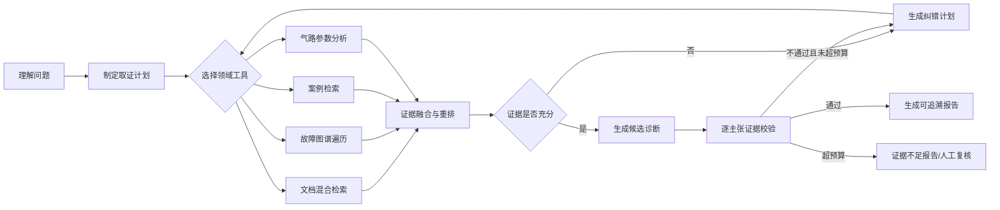

# AeroDiagnosis v3 升级方案

> 目标：将现有“多角色 RAG 原型”升级为面向航空发动机气路故障诊断的、证据驱动且可评测的工具型 Agent 系统。
>
> 状态：方案评审稿；本文件不代表已经实现的能力。任何性能数字必须由可复现实验产生后再写入 README、论文或简历。

## 1. 结论先行

现有项目已经具备向量检索、BM25、知识图谱、案例库、文档解析和 LLM 生成等原型能力，但仍主要是固定顺序的 RAG 流水线。下一阶段不应继续增加“Agent 类”的数量，而应围绕一条可讲清、可验证的主线重构：

**问题理解 → 工具规划 → 多路取证 → 证据评估 → 诊断生成 → 逐主张验证 → 自适应纠错 → 可追溯报告。**

建议将 v3 的核心技术主题命名为：

**Evidence-Grounded Adaptive Diagnostic Agent（证据驱动的自适应诊断 Agent）**。

这是当前阶段的工程与研究主题，不应在论文中预先宣称为原创算法。只有完成相关工作对比、消融实验和统计检验后，才能确定可主张的创新点。

## 2. 当前代码审计

### 2.1 值得保留

- 航空发动机气路故障诊断的垂直领域定位明确。
- 已有向量、BM25、Neo4j 三路数据基础和 RRF 融合雏形。
- 已有文档入库、实体关系抽取、案例库和可视化页面，可作为重构素材。
- 已有诊断—验证—报告的流程概念，适合升级为显式状态机。
- FastAPI、Pydantic、Docker Compose 与异步代码构成了合适的 Python 工程基础。

### 2.2 目前不宜继续对外宣传的内容

| README/代码表象 | 实际情况 | 决策 |
| --- | --- | --- |
| 使用 LangGraph 编排 | `langgraph` 只在依赖文件中，Supervisor 是手写顺序调用 | 重写为真正的 `StateGraph` |
| 多 Agent 自验证闭环 | 验证失败后使用相同问题和上下文重新生成，未吸收失败反馈 | 重写为会改变查询、工具与证据的纠错闭环 |
| 验证保证可靠 | 验证 JSON 解析失败时默认 `passed=True` | 改为 fail-closed 或降级为“无法验证” |
| Kafka/CDC | Kafka 仅存在于 Compose、配置和依赖，无生产者/消费者 | 先删除；只有出现真实跨进程事件需求再引入 |
| ChromaDB 服务 | Compose 启动 Chroma 服务，但代码使用本地 `PersistentClient` | 统一为一种部署模式 |
| 真正 BM25 + 中文分词 | `rank-bm25` 与 `jieba` 未写入 requirements，运行时可能退化到 TF-IDF | 显式依赖、测试并在状态页展示实际后端 |
| 38 个 REST 端点 | 当前源码可数到 21 个路由（含首页） | 修正文档，只陈述可验证事实 |
| 11 种格式解析 | `.doc`、`.pptx`、`.html` 被路由到 `python-docx`，并非真实支持 | 使用格式适配器并逐格式建立 fixture 测试 |
| 安全与鉴权 | 内存明文密码、内存 token，多数管理接口未鉴权 | 重构或在只读演示模式中移除伪安全表述 |
| 可生产部署 | 无测试、CI、依赖锁、迁移、任务恢复和系统级验收 | 先建立工程基线 |

### 2.3 主要代码风险

1. `api/main.py` 同时负责启动、依赖创建、认证、入库、问答、管理与案例接口，边界过重。
2. 存在两套检索实现和两套 RRF 权重，容易产生不可解释的实验结果。
3. 文档用路径生成 `doc_id`，同一文件移动后会被视为新文档；相同路径内容变化又缺少清晰版本语义。
4. 多处吞掉宽泛异常并返回“成功”或空结果，系统可能静默降级。
5. RRF 通过文本前缀去重，可能错误合并不同来源，也无法形成稳定引用。
6. 上传文件名未形成安全、规范化的存储键；入库过程中不同存储可能部分成功。
7. 报告中的引用是提示模型生成的字符串，不是由系统绑定到证据 ID 的可验证引用。
8. 没有离线评测集，因此当前所有“提升召回率、减少幻觉”的描述都缺少实验依据。

## 3. 目标系统：什么才算 Agent

v3 不以“模块名字中是否含 Agent”为判断标准，而使用以下验收标准：

- Agent 接收目标和结构化状态，而不是只接收一段 Prompt；每个节点入口和出口都显式校验状态，不能依赖 LangGraph 只对首节点输入进行的自动校验。
- Agent 能在受控工具集中选择下一步动作。
- 每个工具有 Pydantic 输入/输出模型、超时、错误类型、权限与可观测事件。
- 工具执行结果会改变后续路径；验证失败不能原样重试。
- 执行状态可以持久化、回放和恢复。
- 高风险或证据不足的结论能够中止、降级或请求人工确认。
- 最终结论中的每个关键主张可追溯到稳定的 `evidence_id`。

### 3.1 第一批领域工具

| 工具 | 输入 | 输出 | 作用 |
| --- | --- | --- | --- |
| `search_manual_chunks` | 查询、机型、top_k、过滤条件 | 排序后的证据块 | 稠密/稀疏检索统一入口 |
| `traverse_fault_graph` | 实体、关系白名单、跳数 | 路径与来源证据 | 多跳因果与结构检索 |
| `find_similar_cases` | 症状、机型、参数 | 相似案例及结局 | 案例推理 |
| `analyze_gas_path_parameters` | 参数序列、工况、单位 | 异常特征与置信区间 | 引入非 LLM 的数值诊断能力 |
| `get_evidence_detail` | `evidence_id` | 原文、页码、版本、校验和 | 引用核验 |
| `request_more_evidence` | 未支撑主张、缺失实体 | 修正后的检索计划 | 驱动纠错循环 |

工具调用必须被限制在白名单内。Neo4j 查询由服务端模板构造，不允许 LLM 直接提交任意 Cypher。

所有工具共享同一执行信封：请求包含 `schema_version`、`run_id`、`call_id`、`deadline`、调用者与业务参数；结果状态只能是 `ok/error/timeout/cancelled/degraded`，并携带结构化错误、证据 ID、实际后端和起止时间。FastAPI、LangGraph 与 MCP 负责协议映射，不得改变工具的业务语义。

### 3.2 Agent 图



### 3.3 MCP 的位置

新增一个独立的 MCP Server 适配器，对外暴露只读或受控领域工具，使 Claude Desktop、Codex 或其他 MCP Client 能调用 AeroDiagnosis 的知识与诊断能力。

MCP 不是内部模块间的通信总线。内部 LangGraph 直接依赖领域工具接口；MCP 仅作为与 FastAPI 并列的入站适配器。这样既能展示 MCP 开发能力，又避免内部请求绕一圈网络协议。

## 4. 最值得形成论文贡献的技术主线

### 4.1 自适应工具路由

根据问题类型、复杂度和证据缺口选择无检索、单路检索、多路检索或迭代检索。目标是验证：固定检索策略是否在准确率、延迟和成本之间次优。

### 4.2 证据约束的纠错闭环

Verifier 输出结构化的“不支撑主张、缺失证据类型、建议工具、停止原因”，Planner 据此修改下一轮动作。重试预算同时约束轮次、token、时间和工具次数。

### 4.3 知识图谱增强的故障传播路径

图谱结果不再转成一段无结构文本，而是保留路径、关系、实体、来源 chunk 和置信度。诊断报告可展示“症状—部件—故障模式—原因—维护措施”的证据路径。该能力称为“知识图谱增强 RAG”；除非以后真正实现社区发现、社区摘要和全局/局部搜索等相应方法，否则不将其表述为 Microsoft GraphRAG 的实现。

### 4.4 非 LLM 数值工具与 LLM 协同

加入气路参数分析工具，先用可解释的统计/规则/机器学习方法输出异常特征，再由 Agent 结合手册和图谱形成诊断。这比单纯让 LLM 阅读表格更符合航空故障诊断课题，也便于做定量实验。

## 5. 论文实验设计

### 5.1 研究问题

- **RQ1：** 混合检索相较单一向量检索，是否显著提升领域证据召回与排序质量？
- **RQ2：** 证据评估驱动的纠错循环，是否提升诊断正确性、忠实度和引用准确率？
- **RQ3：** 知识图谱工具对多跳故障问题的贡献是否高于简单事实型问题？
- **RQ4：** 自适应路由能否在质量接近或更优时降低平均延迟、token 与工具调用次数？
- **RQ5：** 数值参数分析工具是否能提升气路参数类故障的诊断准确率与可解释性？

### 5.2 对照与消融组

| 组别 | 配置 |
| --- | --- |
| B0 | 裸 LLM，无知识库 |
| B1 | 仅向量 RAG |
| B2 | 向量 + BM25 + 固定 RRF |
| B3 | B2 + 知识图谱 |
| B4 | B3 + 重排器 |
| B5 | B4 + 固定验证重试 |
| Proposed | B4 + 自适应工具路由 + 证据纠错闭环 + 数值工具 |

至少额外做三项消融：移除图谱、移除纠错反馈、移除参数工具。所有组使用相同数据切分、模型、Prompt 版本和调用预算。

### 5.3 数据集与标注

- 建立版本化的 `eval/datasets/*.jsonl`，每条样本包含问题、问题类型、机型、参考答案、参考证据 ID、参考故障、允许的同义词与风险等级。
- 先完成 30–50 条小型金标准集验证评测管道，再扩展到论文规模；目标规模由可获得且合法的数据决定，不为了数量伪造样本。
- 调参集与最终测试集分离；最终测试集在确定参数后冻结。
- 条件允许时由两名标注者独立标注，报告一致性（如 Cohen's kappa）与分歧处理规则。
- 专有手册不得直接上传公开仓库；公开仓库只放脱敏、合成或授权样本及数据构建脚本。

### 5.4 指标

- 检索：Recall@K、Precision@K、MRR、nDCG@K、图路径召回率。
- 生成：答案正确性、faithfulness、引用准确率/覆盖率、拒答正确率。
- 诊断：Top-1/Top-3 故障准确率、Macro-F1、Brier Score/ECE 置信度校准。
- 工具：工具选择准确率、参数合法率、无效调用率、纠错成功率。
- 工程：p50/p95 延迟、token、估算成本、失败率、恢复成功率。

Ragas 可以用于生成质量的辅助评估，但不能作为唯一证据。关键测试集应保留人工复核和非 LLM 指标。成对实验报告置信区间、效应量，并根据分布选择配对置换检验、Wilcoxon 或其他合适检验；多重比较时进行校正。

### 5.5 可复现要求

- 固定数据集版本、模型标识、Prompt 版本、随机种子、依赖锁和 Docker 镜像。
- 每次实验保存配置快照、Git commit、原始逐样本结果和汇总脚本。
- 不只汇报最佳结果；报告失败样本、限制、威胁效度与成本。
- README、论文和简历中的指标都由同一个机器可读结果文件生成或引用。

## 6. 工程升级路线

### Phase 0：纠正事实与建立工程基线（最高优先级）

预计 2–3 个工作日。

- 将 Python 工程迁移到 `pyproject.toml`，生成可复现 lockfile。
- 建立 `src/`、`tests/`、`eval/`、`docs/`，拆分 FastAPI routers。
- 采用 branch-by-abstraction：先为旧路径补特征测试，在入口后增加新旧实现切换；模块验收通过后逐个迁移，最终整体删除 `code/python`，禁止长期维护两套实现。
- 删除未使用的 Kafka、Zookeeper、PGVector 依赖和重复检索实现；若后续真正使用再添加。
- 建立可替换向量端口；本机默认使用嵌入式持久化实现，Chroma HTTP 只作为学校服务器或其他合规环境的可选适配器，并分别建立契约测试。
- 添加 Ruff、mypy、pytest、coverage 与 GitHub Actions。
- 修正 README 的接口数量、支持格式和安全声明。
- 增加最小领域 fixture，使无 API Key 的 CI 也能运行。

**退出标准：** 新环境一条命令启动；CI 通过；单元测试不依赖真实 LLM；README 只写已实现事实。

### Phase 1：真正的工具型 LangGraph Agent

预计 4–6 个工作日。

- 定义 `DiagnosisState`、`Evidence`、`ToolCall`、`VerificationResult` 等 Pydantic 模型，并在每个节点边界重新构造/校验完整状态。
- 将 Supervisor 重写为 LangGraph `StateGraph`，使用条件边和持久化 checkpoint。
- 建立领域 Tool Registry 与统一错误模型。
- 对所有副作用工具生成稳定 `operation_id`，采用至少一次执行 + 幂等去重；checkpoint 保存工作流版本、单调预算账本和已完成工具调用，版本不兼容时拒绝静默恢复。
- 运行开始时冻结内容寻址的 `RunSnapshot`，绑定语料、图谱、案例库、参数规则/模型及其他工具读源，以及 Git commit、容器/依赖锁摘要、工具实现、检索/Prompt/模型配置；恢复和评测始终使用同一快照，不能静默跨版本或跨构建。
- 加入 SSE 流式事件，在前端展示“选择了什么工具、获得哪些证据、为何纠错”，不暴露模型私有思维链。
- Verifier 异常时进入 `unverified`，禁止默认通过。

**退出标准：** 至少三类问题走出不同工具路径；中断后可恢复；验证失败能改变下一步工具或查询。

### Phase 2：证据与入库管道重构

预计 4–6 个工作日。

- 引入文档清单库，管理 `document_id`、`version_id`、`chunk_id`、哈希、页码和授权信息。
- 使用内容哈希保证幂等入库；明确替换、版本化和删除语义。
- 将解析器改为格式适配器；只宣传有 fixture 测试的格式。
- SQLite 清单是版本可见性的唯一权威；入库按 `received → parsed → indexing → staged → active` 转移，失败进入 `failed`。Chroma/Neo4j 只能写入带 `version_id` 的暂存记录，清单事务核对数量与哈希后才切换 active 指针，检索只读取 active 版本。
- 同一逻辑文档的每次上传在 SQLite 事务中领取单调 `revision` 并更新 `desired_revision`；只有仍等于 desired revision 的 job 可以发布，较旧并发 job 即使成功也只能成为 superseded，不能覆盖 active 指针。
- 建立 SQLite 持久任务表，包含租约、单调 fencing token、心跳、重试上限、退避时间与幂等键；所有发布写入校验最新 fencing token，崩溃恢复器继续未完成步骤或清除孤儿暂存索引，暂不引入 Kafka。

**退出标准：** 重复上传不产生重复索引；失败可恢复；任一报告引用可定位到原文版本与页码。

### Phase 3：自适应检索与诊断闭环

预计 5–8 个工作日。

- 用稳定 chunk ID 去重，统一唯一的加权 RRF 实现。
- 三路检索真正并发；子查询内部也可并发但受限流器控制。
- 增加领域交叉编码重排器，并记录每个阶段的分数。
- 实现证据充分性评估、查询纠错、工具切换和预算停止条件。
- 增加气路参数分析工具及其确定性测试。
- 对置信度做校准，避免把 LLM 自报概率当作真实概率。

**退出标准：** 离线评测能够比较每个检索阶段；纠错链可回放；结论具有逐主张引用。

### Phase 4：MCP 与开放能力

预计 2–4 个工作日。

- 建立 AeroDiagnosis MCP Server，复用领域工具接口。
- 首批只开放查询类工具；写操作必须单独鉴权和审计。
- 提供 Claude Desktop/Codex 等客户端配置示例和一次完整调用录屏。
- 加入 MCP 契约测试，防止工具 schema 漂移。

**退出标准：** 外部 MCP Client 能发现工具、调用工具并取得带证据 ID 的结构化结果。

### Phase 5：实验、论文与 GitHub 展示

预计 5–10 个工作日，取决于数据标注量和 LLM 调用成本。

- 完成基线、消融、统计检验、错误分析与实验报告。
- 输出论文可直接使用的系统架构图、算法流程图、表格和实验图。
- 重写 README，增加 60–90 秒演示 GIF/视频、架构图、复现实验命令和实际指标。
- 发布 `v3.0.0` GitHub Release，并附示例数据与变更说明。

**退出标准：** 新用户按 README 可复现；论文数字可追溯到原始结果；面试演示在无临时手工操作下完成。

## 7. 建议代码结构

```text
AeroDiagnosis/
  src/aerodiagnosis/
    domain/          # 领域实体、证据和诊断规则；不依赖框架
    application/     # LangGraph 工作流、用例、工具端口
    tools/           # 检索、图谱、案例、参数分析工具实现
    adapters/
      api/           # FastAPI
      mcp/           # MCP Server
      persistence/   # Chroma、Neo4j、SQLite/checkpoint
      llm/           # 模型与 embedding 适配器
    ingestion/       # 版本化文档入库
    observability/   # trace、metric、audit event
  tests/
    unit/
    contract/
    integration/
    e2e/
  eval/
    datasets/
    configs/
    runners/
    reports/
  docs/
    architecture/
    thesis/
    images/
  docker-compose.yml
  pyproject.toml
  uv.lock
```

## 8. 安全与可靠性底线

- 删除 `admin/admin123` 与内存 token。公开托管演示固定为匿名只读；本地课题模式的写操作仅绑定 loopback，并要求启动时从环境注入 operator token。若未来需要公开写入，再单独设计 OIDC/RBAC，不在当前版本伪造用户系统。
- 上传使用服务端生成的存储名，限制扩展名、MIME、大小和解压资源，禁止路径穿越。
- LLM 不能执行任意 Cypher、文件系统或 shell；所有工具参数先通过 schema 与策略校验。
- Prompt injection 防护以数据/指令分离、工具白名单、最小权限和输出验证为主，不声称可以彻底消除攻击。
- 不记录模型私有思维链或证据原文；telemetry 只允许记录工具名、经过字段白名单的输入摘要、内容哈希/长度、证据 ID、状态转移、耗时、token 与结构化错误。服务端自行生成 trace/run 身份，只向白名单后端传播 W3C trace context，并丢弃客户端 baggage。
- 依赖外部服务时设置超时、有限重试、熔断/降级状态，并将降级显示给用户。

## 9. GitHub 展示清单

- README 首屏：一句定位、架构图、演示 GIF、可验证指标、快速启动。
- 添加 `LICENSE`、`CONTRIBUTING.md`、安全说明、版本路线和 Release。
- GitHub Actions 展示 lint、type check、unit、integration、evaluation smoke test。
- 提供 `.env.example`，但不提供任何真实密钥或专有数据。
- 提供 `make demo` 或跨平台等价的一键命令，自动注入公开样例。
- `docs/thesis/` 保存方法、实验协议、消融表和威胁效度；论文正式文本可保持私有。
- Issue/PR 模板、规范化 commit 和变更日志作为工程成熟度补充，不应取代核心技术质量。

## 10. 简历与面试映射

在实验完成前，简历只描述设计与实现，不写虚构提升比例。可以先使用：

> 设计并实现面向航空发动机故障诊断的工具型 Agent 系统，基于 LangGraph 构建可持久化状态机，将文档混合检索、Neo4j 故障图谱、案例检索和气路参数分析封装为结构化领域工具；通过证据充分性评估与逐主张验证驱动自适应纠错，并提供可追溯引用与 MCP 接入。

实验完成后再替换为带真实数字的两条：

> 构建包含 `[N]` 条领域问题的版本化评测集，通过向量/BM25/图谱/重排/纠错闭环消融实验，使 `[核心指标]` 相比 `[基线]` 提升 `[真实数值]`，同时将 p95 延迟/平均 token 控制在 `[真实数值]`。

> 建立 pytest + GitHub Actions 质量门禁与 Docker 一键环境，实现文档幂等入库、Agent checkpoint 恢复、MCP 工具契约测试和端到端诊断回放，测试覆盖率达到 `[真实数值]`。

面试演示建议固定为 8 分钟：

1. 30 秒说明问题与原型不足。
2. 90 秒画出 Agent 状态图和工具边界。
3. 3 分钟运行一个复杂故障，让界面展示工具选择、证据路径和一次纠错。
4. 2 分钟展示消融结果与失败案例。
5. 1 分钟说明为什么删除 Kafka、为什么 MCP 只做适配器、系统仍有哪些限制。

## 11. 论文内容映射

| 论文部分 | 可沉淀内容 |
| --- | --- |
| 绪论 | 航空发动机诊断、RAG 证据可靠性和多源知识协同问题 |
| 相关技术 | RAG、GraphRAG、Agentic RAG、工具调用、状态图、故障诊断指标 |
| 方法章节 | 自适应工具路由、证据模型、纠错状态机、图谱路径与数值工具协同 |
| 系统设计 | 六边形模块化单体、入库管道、工具契约、MCP/API 适配器、可观测性 |
| 实验章节 | 基线、消融、统计检验、效率、错误分析、威胁效度 |
| 总结 | 已验证贡献、边界、数据与模型限制、未来工作 |

## 12. 参考依据（方案阶段）

- [Self-RAG](https://openreview.net/forum?id=hSyW5go0v8)：检索、生成与自反思结合的研究路线；本项目仅借鉴思想，不声称复现其训练方法。
- [Corrective RAG](https://openreview.net/forum?id=HHeDtTQibwg)：检索质量评估与纠错动作；本项目仅借鉴思想。
- [Adaptive-RAG](https://aclanthology.org/2024.naacl-long.389/)：根据问题复杂度选择检索策略；本项目仅借鉴思想。
- [Microsoft GraphRAG](https://microsoft.github.io/graphrag/)：图结构增强语料理解和检索；本项目当前不是其实现。
- [LangGraph 官方文档](https://docs.langchain.com/oss/python/langgraph/overview)：StateGraph、持久化、故障恢复与 human-in-the-loop。
- [MCP Python SDK](https://pypi.org/project/mcp/)：对外暴露标准化工具、资源和 Prompt 的协议适配器。
- [Ragas 指标文档](https://docs.ragas.io/en/stable/concepts/metrics/)：context precision/recall、faithfulness 等辅助评测定义。
- [OpenTelemetry Python](https://opentelemetry.io/docs/languages/python/)：标准化 trace、metric 和 exception 记录。
- [GitHub Actions Python CI](https://docs.github.com/en/actions/tutorials/build-and-test-code/python)：Python 构建、测试和持续集成。

具体链接与访问日期应在论文参考文献管理器中统一维护；论文引用优先使用正式会议/期刊版本，不以项目 README 或博客代替学术来源。上述方法都只是设计依据，最终论文必须清楚区分“借鉴”“复现”“改进”和“原创”。

## 13. 建议执行顺序

严格按照 `Phase 0 → Phase 1 → Phase 2 → Phase 3 → Phase 4 → Phase 5` 推进。MCP 和界面美化不能抢在真实状态机、证据契约与评测管道之前。第一轮实现建议单独建立 `feat/v3-foundation` 分支，完成 Phase 0 后再进入 Agent 重构。
